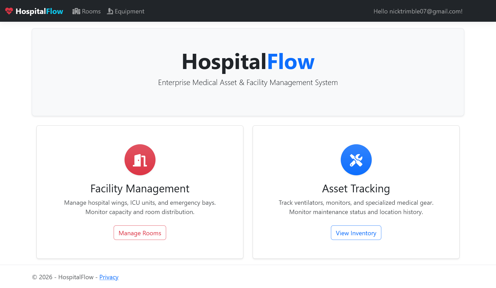

HospitalFlow

Real-time hospital resource tracking dashboard built with ASP.NET Core MVC and SignalR.

Overview

Tracks hospital rooms and equipment in real time, allowing live updates across connected clients.

Features

- Real-time updates via SignalR (WebSockets)
- Equipment and room assignment tracking
- CRUD workflows for hospital assets
- Relational data modeling using EF Core
- Dockerized deployment pipeline

Tech Stack

- ASP.NET Core MVC (.NET 10)
- PostgreSQL
- Entity Framework Core
- SignalR
- Docker

Deployment

Deployed on Render using Docker containerization.